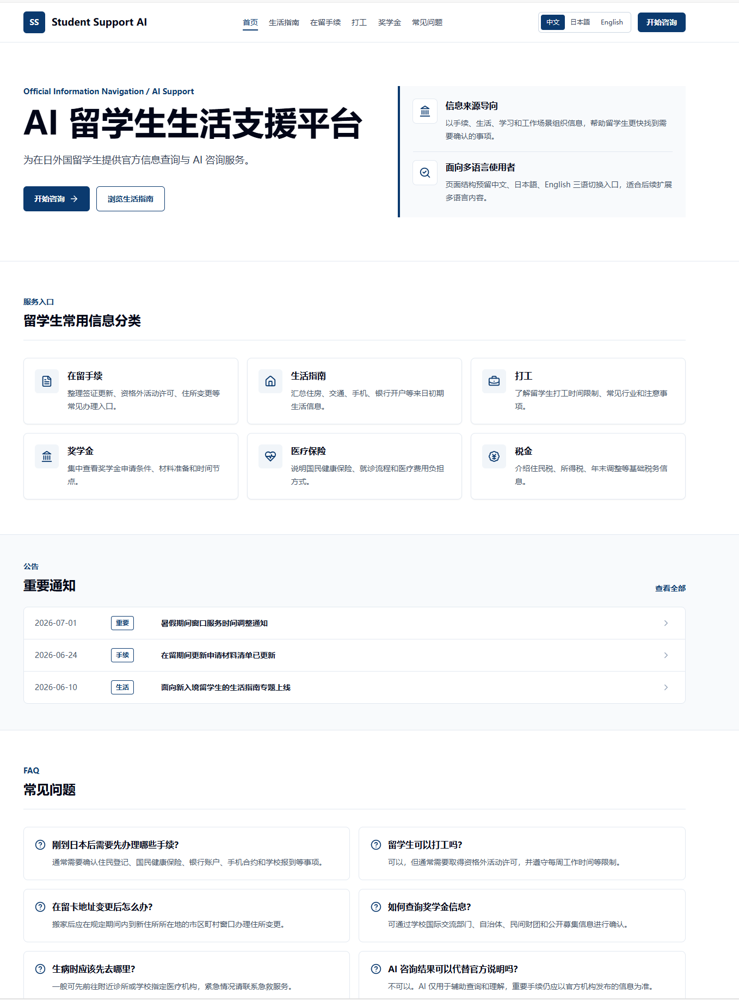
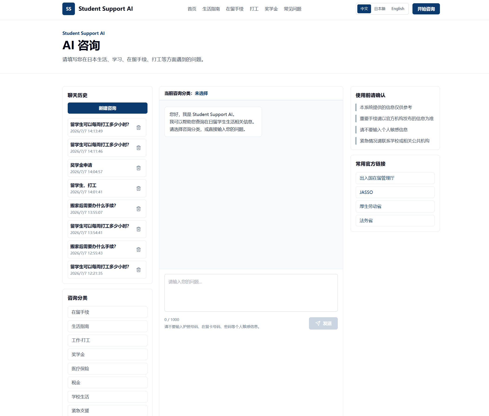
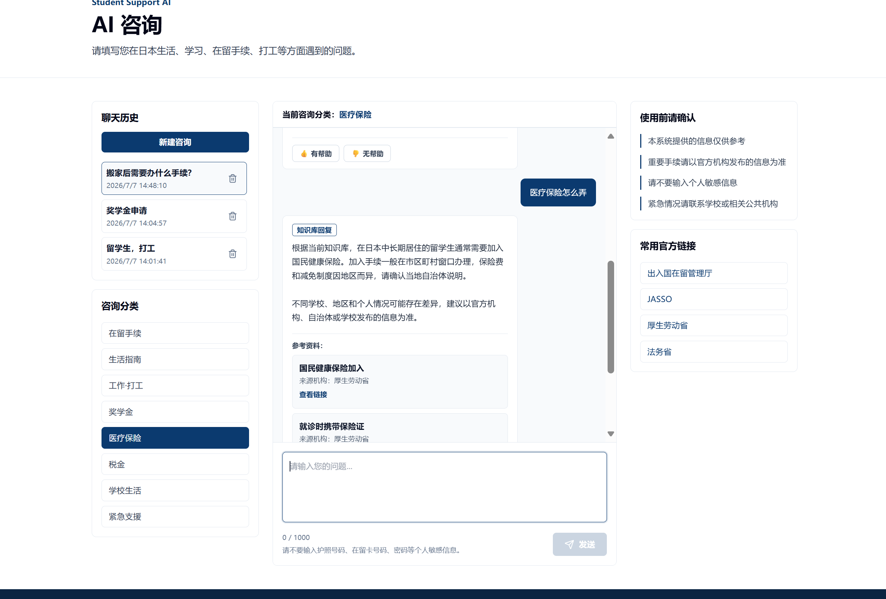
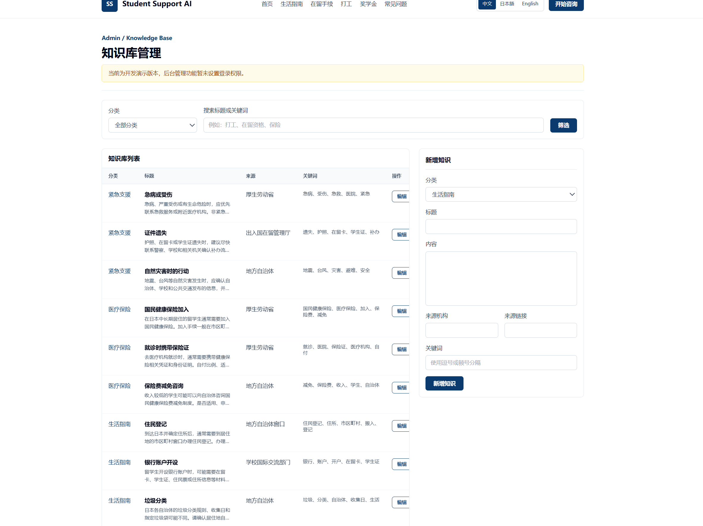
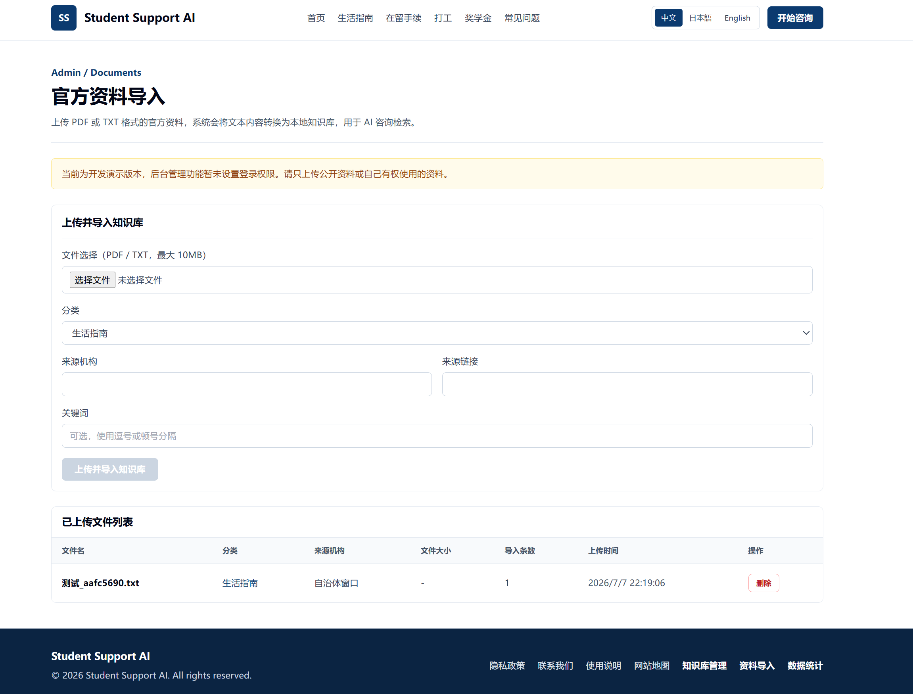
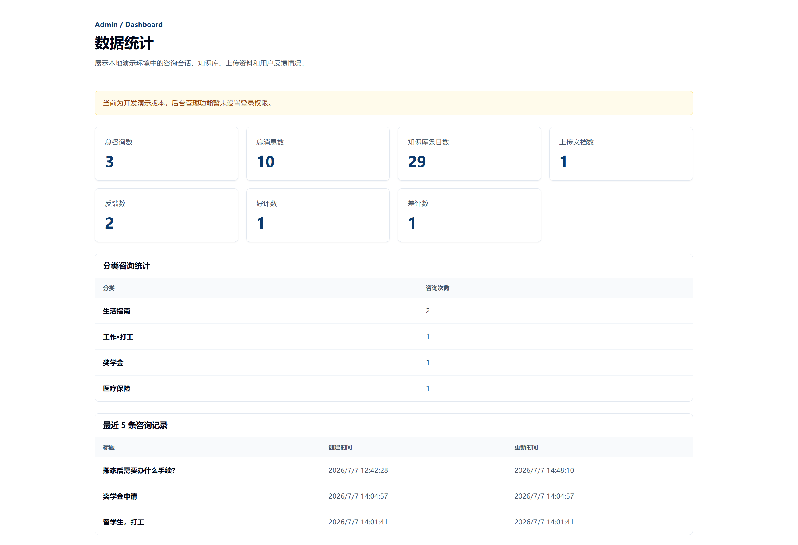

# Student Support AI

Student Support AI 是一个面向在日外国留学生的 AI 生活支援系统。项目通过本地知识库检索和官方资料导入功能，为在留手续、生活指南、打工、保险、税金、学校生活等场景提供信息查询支持。

当前版本是作品集展示版 V1：不依赖外部 AI API，不需要登录，适合本地演示、毕业设计说明和企业面试展示。

## 功能列表

- 政府门户风格首页
- 多页面导航
- AI 咨询页面
- 本地知识库 RAG
- 聊天历史
- 用户反馈
- 数据统计后台
- 知识库管理
- PDF/TXT 官方资料导入
- 参考资料显示

## Screenshots

### Home Page



首页采用政府门户网站风格，提供清晰的信息分区、导航入口和面向留学生的服务分类。用户可以从首页快速进入生活指南、在留手续、打工、奖学金等核心模块。

### AI Consultation



AI 咨询页面提供分类选择、聊天输入、历史会话和使用注意事项。当前版本基于本地知识库检索生成回复，不依赖外部 AI API。

### Knowledge-based Answer with References



系统会在回答下方展示参考资料卡片，帮助用户理解回答依据。回答正文与来源信息分离，便于后续扩展为更完整的 RAG 引用体系。

### Knowledge Base Admin



知识库管理后台支持按分类和关键词筛选知识条目，并提供新增、编辑、删除能力。该页面用于维护本地 JSON 知识库内容。

### Official Document Import



官方资料导入页面支持上传 PDF/TXT 文件，并将可解析文本切分为知识库条目。导入后的内容可以被聊天页面检索并作为参考资料展示。

### Admin Dashboard



数据统计后台展示咨询数、消息数、知识库条目数、上传文档数、用户反馈和分类咨询统计。该页面用于作品集演示系统使用情况和管理闭环。

## 技术栈

Frontend: React, TypeScript, Vite, Tailwind CSS, React Router

Backend: FastAPI, SQLAlchemy, SQLite, PyMuPDF

Data: JSON Knowledge Base, Uploaded Documents

## 系统架构

```text
Frontend
  ↓
FastAPI Backend
  ↓
Knowledge Search Service
  ↓
JSON Knowledge Base / Uploaded Documents
  ↓
Chat Response
```

用户在 `/chat` 输入问题后，后端会先根据分类和问题检索本地 JSON 知识库，再生成知识库回复，并把参考资料通过 `references` 字段返回给前端展示。

## 本地启动方法

后端：

```powershell
cd backend
python -m venv .venv
.\.venv\Scripts\Activate.ps1
pip install -r requirements.txt
uvicorn app.main:app --reload
```

前端：

```powershell
cd frontend
npm install
npm run dev
```

也可以使用脚本：

```powershell
.\scripts\start_backend.ps1
.\scripts\start_frontend.ps1
```

前端默认地址：`http://127.0.0.1:5173`

后端默认地址：`http://127.0.0.1:8000`

## 环境变量

前端示例：

```text
frontend/.env.example
VITE_API_BASE_URL=http://127.0.0.1:8000
```

后端示例：

```text
backend/.env.example
APP_NAME=Student Support AI
DATABASE_URL=sqlite:///./app/data/app.db
CORS_ORIGINS=http://127.0.0.1:5173,http://localhost:5173
OPENAI_API_KEY=
OPENAI_MODEL=gpt-4o-mini
```

当前版本不使用 OpenAI API，即使没有 `OPENAI_API_KEY` 也可以正常运行。

## 主要页面

- `/`
- `/chat`
- `/admin/knowledge`
- `/admin/documents`
- `/admin/dashboard`
- `/visa`
- `/life`
- `/work`
- `/scholarship`
- `/insurance`
- `/school`
- `/emergency`
- `/faq`

## API 示例

- `GET /health`
- `POST /api/chat`
- `GET /api/knowledge`
- `POST /api/documents/upload`
- `GET /api/admin/dashboard`

## Docker

项目包含 Dockerfile 和 `docker-compose.yml`。当前推荐本地开发方式启动，Docker 配置保留为作品集部署基础。

```powershell
docker compose up --build
```

后端端口：`8000`

前端端口：`5173`

## 测试

```powershell
cd backend
pytest
```

前端：

```powershell
cd frontend
npm run lint
npm run build
```

## 当前版本限制

- 当前未设置登录权限
- 当前不使用 OpenAI API
- 当前未使用 FAISS 向量检索
- 当前 PDF 仅支持可提取文本的 PDF，不支持扫描图片 OCR
- 重要手续请以官方机构发布的信息为准

## 后续计划

- 用户登录
- OpenAI API 接入
- FAISS 向量检索
- OCR 支持
- 部署上线
- 多语言内容完善
